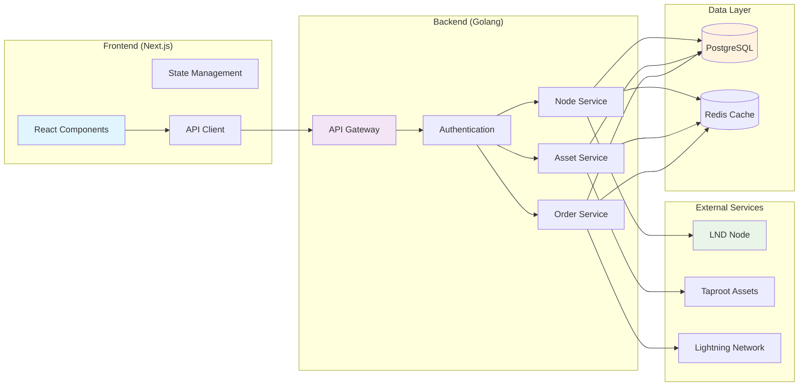
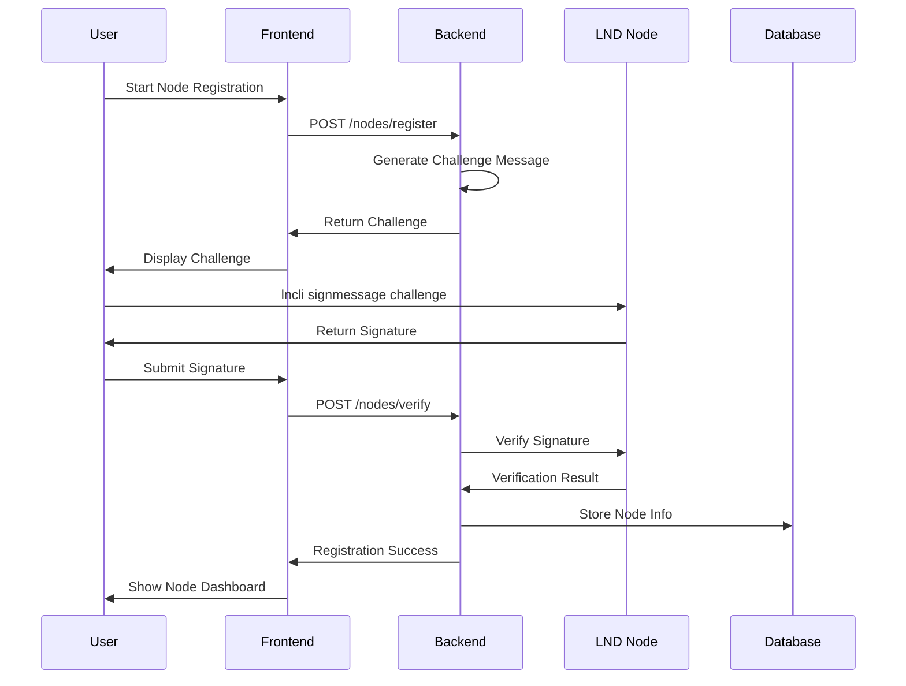
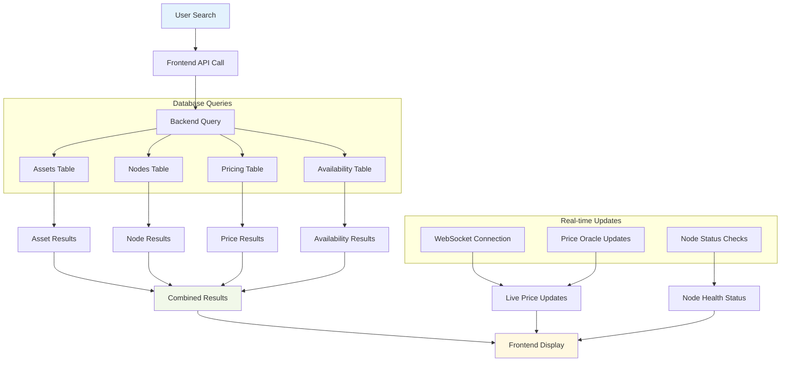
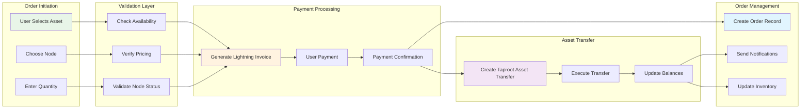
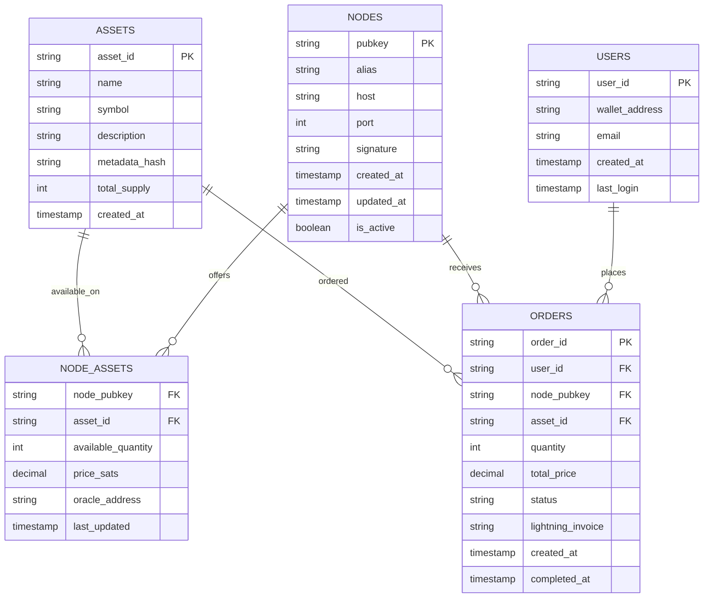

# Orange Pages

> **"Amboss for Taproot Assets"** - A decentralized marketplace and explorer for Taproot Assets on the Lightning Network

## 📋 Planning & Resources

### How to Win Hackathons Guide
- **Video**: [Hackathon Winning Strategies](https://x.com/btcplusplus/status/1897683832293191933)
- **Slides**: [Presentation Deck](https://docs.google.com/presentation/d/1hkMFcVrXvMD6uJjWQS3HpWGXktntgLvmh-BYOS_Lt78/edit?usp=sharing)

---

## 🍊 Orange Pages Overview

### What is Orange Pages?
Orange Pages is a decentralized marketplace and explorer for Taproot Assets on the Lightning Network. Think of it as "Amboss for Taproot Assets", a platform where node operators can showcase their Taproot Asset offerings and users can discover, browse, and order assets from various providers.

### Problem We're Solving

1. **Discovery Problem**: Currently, there's no easy way to find which Lightning nodes offer specific Taproot Assets
2. **Trust Problem**: Users can't verify which nodes actually hold and can transfer specific assets
3. **Liquidity Problem**: Asset holders and seekers have no efficient marketplace to connect
4. **UX Problem**: Ordering Taproot Assets requires technical knowledge and manual coordination

### Our Solution
A user-friendly web platform that:
- Allows node operators to claim and customize their node pages
- Verifies node ownership through cryptographic signatures
- Displays real-time asset availability and pricing
- Enables one-click ordering and channel opening
- Provides reputation and uptime tracking

---

## 🛠 Technical Stack

- **Backend**: Golang with LND/Taproot Assets integration
- **Frontend**: Next.js with TypeScript and Tailwind CSS
- **Network**: Mutinynet (Bitcoin testnet)
- **Database**: PostgreSQL with Redis caching

---

## 👥 User Types & Features

### Edge Node Runner User

#### Node Registration & Claiming
- Prove ownership via `lncli signmessage` verification
- Custom page creation with node details
- Asset listing management

#### Node Information Display
- Supported Taproot Assets
- Pricing information (sats per asset unit)
- Oracle address configuration
- Channel capacity and availability
- Node reputation/uptime metrics

#### Management Tools
- Update pricing dynamically
- Set oracle address
- Configure asset availability
- View order history

### Menu Users

#### Asset Discovery
- Browse all available Taproot Assets
- Filter by asset type, price, node reputation
- Search functionality

#### Node Explorer
- View detailed node information
- One-click actions:
  - Copy node pubkey
  - Open channel (with QR code support)
  - View node's Amboss page (if available)

#### Asset Ordering
- Simple order flow
- Real-time availability checking
- Order status tracking

### Admin Features (Stretch)
- **Node Health Monitoring**
  - Automatic availability checks
  - Remove inactive nodes
  - Flag suspicious activity

---

## 🔌 API Specification

### Base URL
```
https://api.orangepages.io/v1
```

### Authentication
- API Key for write operations
- Public read access for browsing

### Endpoints

#### Asset Endpoints
```
GET    /assets                    // List all available assets
GET    /assets/:asset_id          // Get specific asset details
GET    /assets/:asset_id/nodes    // Get nodes offering this asset
```

#### Node Endpoints
```
GET    /nodes                     // List all registered nodes
GET    /nodes/:pubkey             // Get node details
POST   /nodes/register            // Register new node
PUT    /nodes/:pubkey             // Update node information
POST   /nodes/:pubkey/verify      // Verify node ownership
```

#### Edge Node Specific
```
GET    /nodes/:pubkey/prices      // Get node's asset prices
PUT    /nodes/:pubkey/prices      // Update asset prices
GET    /nodes/:pubkey/oracle      // Get price oracle address
PUT    /nodes/:pubkey/oracle      // Update oracle address
```

#### Order Endpoints
```
POST   /orders                    // Create new order
GET    /orders/:order_id          // Get order status
GET    /nodes/:pubkey/orders      // Get node's orders
```

### Response Format
```json
{
  "status": "success|error",
  "data": {},
  "meta": {
    "timestamp": "2024-01-01T00:00:00Z",
    "version": "1.0"
  }
}
```

---

## 🎯 Success Criteria

### MVP Requirements
- [ ] Node registration and verification
- [ ] Asset listing and browsing
- [ ] Basic order placement
- [ ] Node information display
- [ ] Working demo on Mutinynet

### Demo Ideas

#### Setup
- Deploy 3-4 Mutinynet nodes with different Taproot Assets
- Register nodes on Orange Pages
- Configure pricing and availability

#### Demo Flow

**Node Operator Journey**
1. Show node claiming process
2. Demonstrate ownership verification
3. Update asset prices
4. Show incoming orders

**User Journey**
1. Browse available assets
2. Filter by specific asset (Stablecoin XYZ)
3. Compare prices across nodes
4. Place order
5. Open channel to selected node

#### Advanced Features (Stretch)
- Real-time price updates
- Node reputation display
- Order history

---

## 👨‍💻 Team Composition

### Bob (Backend Lead)
**Skills**
- Backend
- Golang
- Taproot-assets lightninglabs repo
- Lightning node management/deployment
- LND, lightning terminal

**Tasks**
- Golang backend architecture
- Taproot Assets integration
- LND/Lightning Terminal integration
- Node verification system
- Core API endpoints

### Andrew (Backend)
**Tasks**
- API development and routing
- Database design and optimization
- Authentication/verification logic
- Backend testing infrastructure
- Performance optimization

### Jon (Frontend Lead)
**Skills**
- Fullstack
- Python / Rust
- Typescript / React / React Native

**Tasks**
- Next.js architecture and setup
- UI/UX implementation
- Component library development
- Real-time features (WebSocket client)
- Frontend state management (Zustand/React Query)

### Kyle (Frontend)
**Skills**
- Fullstack
- Python / Rust
- Typescript / React

**Tasks**
- React component development
- API client integration
- TypeScript type definitions
- Responsive design implementation
- Frontend testing and debugging

### Available Hours

| Team Member | Friday | Saturday | Sunday |
|-------------|--------|----------|--------|
| **Bob** | Evening thru entire weekend | All day | All day |
| **Andrew** | TBD | TBD | TBD |
| **Jon** | Available most times | All day | All day |
| **Kyle** | Available most times | After ~4 PM EST | All day |

---

## 🏆 Hackathon Submission Requirements

Your hackathon submission should include:

1. **Overview of the project** - What problem does it solve?
2. **Demo** - Working demonstration of the core functionality
3. **Summary of new things learned** - Technical insights and discoveries during development

---

## 🔄 User Flows & Data Architecture

### User Journey Flow

```mermaid
flowchart TD
  A[Home Page] --> B[Connect Wallet / Login]
  B --> C{User Type?}

  C -->|Node Runner| D[Claim Node Wizard]
  D --> E[Verify via lncli signmessage]
  E --> F[Complete Node Profile]
  F --> G[Node Dashboard]

  C -->|Regular User| H[Asset Discovery Page]
  H --> I[Filter/Search Assets]
  I --> J[View Asset Details]
  J --> K[View Node Offering Asset]
  K --> L[Open Channel / Copy Pubkey]
  J --> M[Order Asset]

  M --> N[Checkout Page]
  N --> O[Pay Invoice (Lightning)]
  O --> P[Order Status Tracking]

  G --> Q[Manage Assets]
  G --> R[Update Pricing & Availability]
  G --> S[View Order History]
  G --> T[Settings (Oracle, Wallet)]

  style A fill:#1f1f1f,stroke:#555,stroke-width:2px
  style B fill:#2b2b2b
  style C fill:#333
  style D,F,G,H,I,J,K,M,N,O,P,Q,R,S,T fill:#2a2a2a
  style E fill:#444
```

### System Data Flow



### Node Registration Data Flow



### Asset Discovery Data Flow



### Order Processing Data Flow



### Database Schema Flow



---

## 🚀 Getting Started

### Prerequisites
- Node.js 18+
- Go 1.21+
- PostgreSQL
- Redis
- LND node (for testing)

### Installation

1. **Clone the repository**
   ```bash
   git clone https://github.com/your-org/orange-pages.git
   cd orange-pages
   ```

2. **Install dependencies**
   ```bash
   # Frontend
   npm install
   
   # Backend
   cd backend
   go mod download
   ```

3. **Set up environment variables**
   ```bash
   cp .env.example .env
   # Edit .env with your configuration
   ```

4. **Run the development server**
   ```bash
   # Frontend
   npm run dev
   
   # Backend
   cd backend
   go run main.go
   ```

---

## 📝 License

This project is licensed under the MIT License - see the [LICENSE](LICENSE) file for details.

---

## 🤝 Contributing

1. Fork the repository
2. Create your feature branch (`git checkout -b feature/amazing-feature`)
3. Commit your changes (`git commit -m 'Add some amazing feature'`)
4. Push to the branch (`git push origin feature/amazing-feature`)
5. Open a Pull Request

---

## 📞 Contact

- **Project Link**: [https://github.com/your-org/orange-pages](https://github.com/your-org/orange-pages)
- **Demo**: [https://orange-pages.vercel.app](https://orange-pages.vercel.app)

---

*Built with ❤️ for the Bitcoin Lightning Network community*
